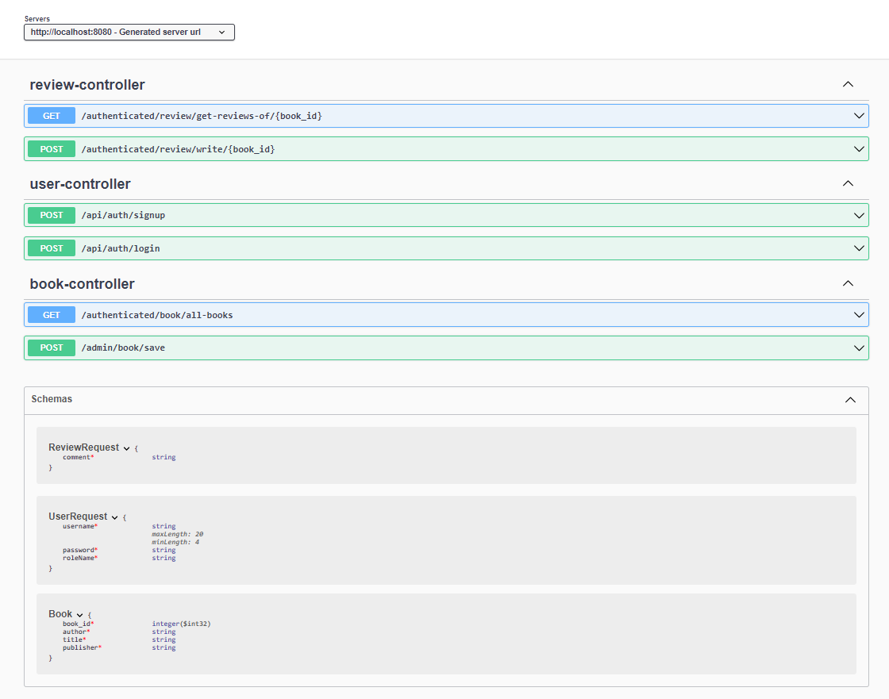
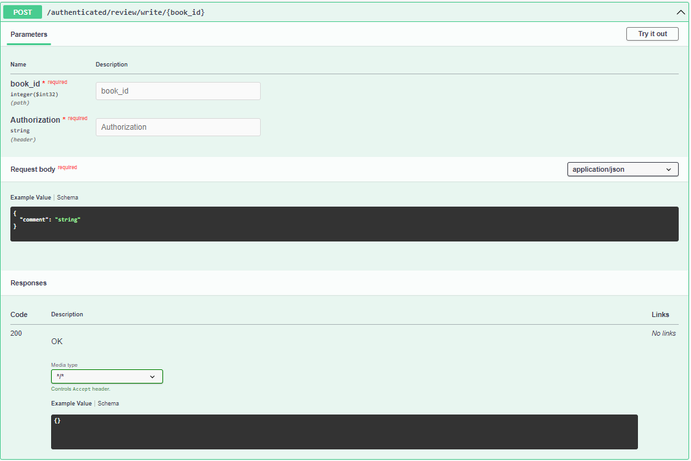

# online-book-review-system


## Requirements

For building and running the application you need:

- [JDK 17](https://www.oracle.com/java/technologies/downloads/#java17)
- [Maven 3](https://maven.apache.org)
- [Spring Tool Suite](https://spring.io/tools)


## Running the application locally

There are several ways to run a Spring Boot application on your local machine. One way is to execute the `main` method in the `dev.abibou.bookreview.BookReviewApplication`class from your IDE.

Alternatively you can use the [Spring Boot Maven plugin](https://docs.spring.io/spring-boot/docs/current/reference/html/build-tool-plugins-maven-plugin.html) like so:

```shell
mvn spring-boot:run
```

#### Swagger documentation 
`http://localhost:8080/swagger/swagger-ui/index.html#/`

List of API:


Details of `/review/write/{book_id}`

